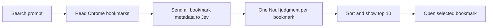

# Bookmark Compass

A Chrome extension built with [Extension.js](https://extension.js.org/) that finds bookmarks from a natural-language prompt. It sends all bookmark metadata to Jev through [`@typesafe-ai/sdk`](https://www.npmjs.com/package/@typesafe-ai/sdk) and ranks every bookmark by semantic relevance.

The popup UI uses Radix Themes, Colors, and Icons.

## How it works



A TypeSafe API key is required to search. Each search sends every bookmark's title, URL, and folder path to Jev in bounded System One request batches. Jev evaluates one comparable Noul relevance judgment per bookmark, and the extension combines and sorts the returned probabilities.

## Setup

Requirements:

- Node.js 22.12 or newer
- Chrome
- A TypeSafe API key from [console.typesafe.ai](https://console.typesafe.ai/)

Install and build:

```sh
npm install
npm run build
```

Then open `chrome://extensions`, enable **Developer mode**, choose **Load unpacked**, and select `dist/chrome`.

Open the extension, select **Settings**, paste `TYPESAFE_API_KEY`, and save it. The key can be revealed, replaced, or removed from the same dialog.

For Extension.js watch mode:

```sh
npm run dev
```

## API-key security

The key is stored in `chrome.storage.local`; it is not synced to the user's Google account. The extension calls `https://api.typesafe.ai` directly because this project has no backend.

Browser extensions cannot protect credentials as strongly as a server. Use a dedicated, revocable TypeSafe key and remove it when no longer needed. Do not publish a key in source code or bundle it at build time.

Every search sends all bookmark titles, URLs, and folder paths to TypeSafe. Large bookmark collections also increase request size, latency, and API usage.

## Permissions

| Permission | Purpose |
| --- | --- |
| `bookmarks` | Read bookmark titles, URLs, folders, and dates for search. |
| `storage` | Store the user-provided API key locally. |
| `https://api.typesafe.ai/*` | Send all bookmark metadata to Jev for semantic ranking. |

## Commands

```sh
npm run check      # Biome
npm test           # Vitest
npm run typecheck  # TypeScript
npm run build      # Production Chrome extension
npm run pack       # Chrome Web Store ZIP
npm run ci         # All checks above
```

## Project layout

- `src/manifest.json` — Manifest V3 permissions and popup entry.
- `src/popup/` — React and Radix popup UI.
- `src/lib/bookmarks.ts` — flatten the complete Chrome bookmark tree.
- `src/lib/rerank.ts` — Jev Noul questions and semantic sort.
- `src/lib/storage.ts` — local API-key persistence.
- `tests/` — bookmark extraction and Jev reranking unit tests.
